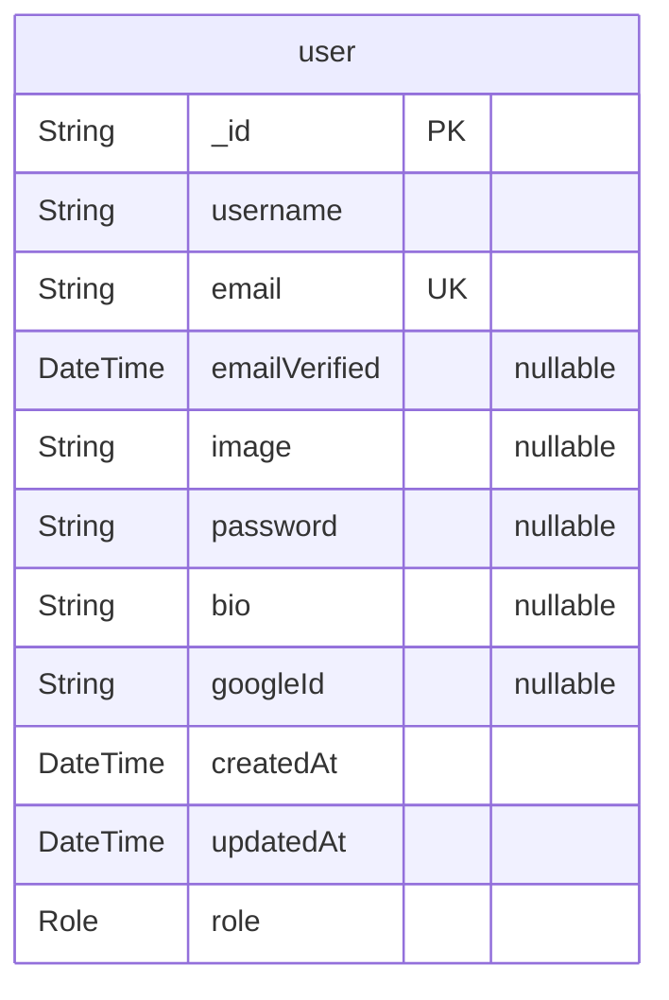

# Entity-Relationship Diagram
> Generated by [`prisma-markdown`](https://github.com/samchon/prisma-markdown)

- [default](#default)

## default

### `user`

**Properties**
  - `_id`: 
  - `username`: 
  - `email`: 
  - `emailVerified`: 
  - `image`: 
  - `password`: 
  - `bio`: 
  - `googleId`: 
  - `createdAt`: 
  - `updatedAt`: 
  - `role`: 